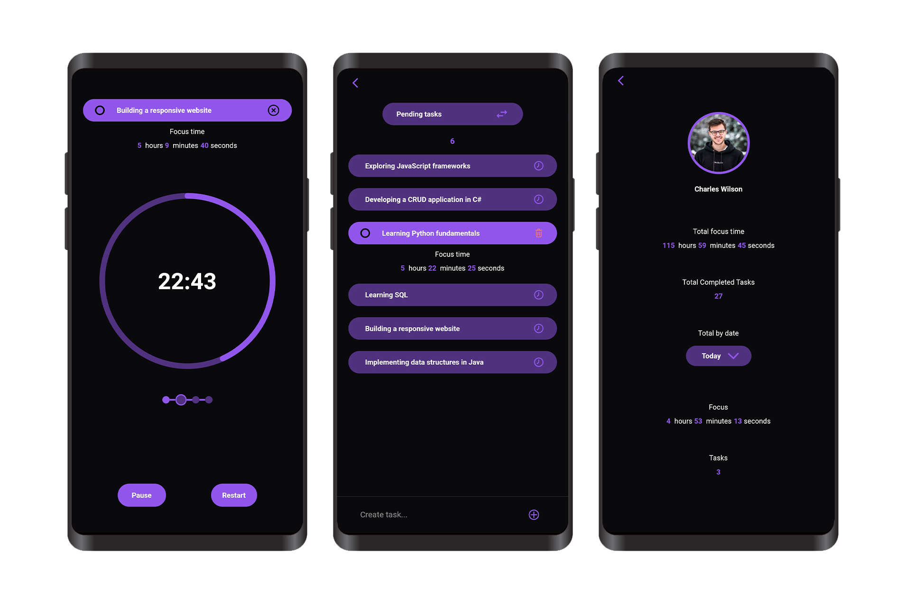

&nbsp;&nbsp;
&nbsp;&nbsp;
&nbsp;&nbsp;

# Time Sense
### Time Sense is an innovative app blending the concepts of a Pomodoro timer and task management. Users can create tasks and complete them within Pomodoro intervals, effectively tracking time spent on each task. This fusion allows for efficient task management while monitoring time allocation for increased productivity.

  

## Core Features:
* Pomodoro Timer:  
Customizable Pomodoro Cycles. Link tasks to cycles for focused work sessions.

* Task Management:
Users can create, organize, and track time for each task. 

* Notification System:
Alerts users when a Pomodoro session ends. 

* User Statistics:
Users can view their overall focus time, completed tasks, and detailed breakdowns by date. 
 

### These combined features can create a comprehensive user experience for individuals seeking to manage their time and productivity using the Pomodoro technique.

 

## Dependencies

     
 Click to expand 

* [flutter_localizations](https://pub.dev/packages/flutter_localization)
* [flutter_svg](https://pub.dev/packages/flutter_svg)
* [circular_countdown_timer](https://pub.dev/packages/circular_countdown_timer)
* [provider](https://pub.dev/packages/provider)
* [sqflite](https://pub.dev/packages/sqflite)
* [wakelock](https://pub.dev/packages/wakelock)
* [equatable](https://pub.dev/packages/equatable)
* [uuid](https://pub.dev/packages/uuid)
* [flutter_phoenix](https://pub.dev/packages/flutter_phoenix)
* [intl](https://pub.dev/packages/intl)
* [flutter_native_splash](https://pub.dev/packages/flutter_native_splash)
* [flutter_launcher_icons](https://pub.dev/packages/flutter_launcher_icons)
* [flutter_local_notifications](https://pub.dev/packages/flutter_local_notifications)
* [timezone](https://pub.dev/packages/timezone)
* [flutter_native_timezone_updated_gradle](https://pub.dev/packages/flutter_native_timezone_updated_gradle)
* [permission_handler](https://pub.dev/packages/permission_handler)
* [image_picker](https://pub.dev/packages/image_picker)
* [calendar_date_picker2](https://pub.dev/packages/calendar_date_picker2)
* [flutter_image_compress](https://pub.dev/packages/flutter_image_compress)
* [flutter_animate](https://pub.dev/packages/flutter_animate)

